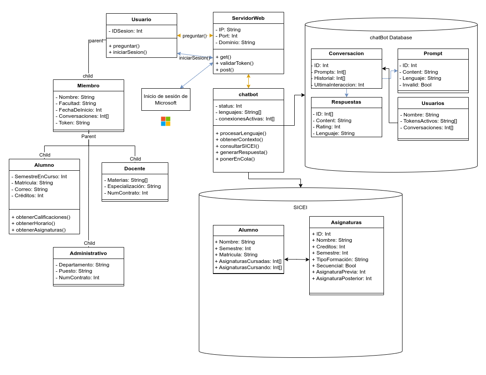

# Diseño de datos

## Índice
* ### [Clases de usuario](#clases-de-usuario)
    * [Usuario](#usuario)
    * Miembro
    * Alumno
    * Docente
    * Administrativo
* ### Servidor web
* ### Inicio de sesión de Microsoft
* ### Chatbot
* ### SICEI
    * Alumno
    * Asignaturas
* ### Chatbot Database
    * Conversación
    * Respuestas
    * Prompt
    * Usuarios

## Clases de usuario
Este conjunto de clases hace referencia a los distintos tipos de usuarios presentes en la estructura del proyecto.

### Usuario
#### **IDSesion**
|Tipo de dato|
|---|
|Int|

*Descripción*\
El atributo IDSesion hace referencia al número de la sesión activa actual, con este ID se harán las comunicaciones entre el usuario y el servidor.

#### **preguntar()**
|Argumento|Tipo de dato|
|---|---|
|Prompt| String|

#### **iniciarSesion()**
Esta es una función void que redirecciona al usuario a la pagina de login de Microsoft.

### Miembro
Clase principal de los usuarios que estan autenticados, de la cual derivan las demas.

#### **Nombre**
|Tipo de dato|
|---|
| String |

*Descripción*\
Nombre completo de las personas autenticadas.

#### **Facultad**
| Tipo de dato |
|---|
| String |

*Descripción*\
Facultad de procedencia del usuario autenticado.

*Ejemplos*
| Valor |
|---|
| Facultad de matemáticas |
| Facultad de medicina |
| Facultad de derecho |

#### **FechaDeInicio**
| Tipo de dato |
|---|
| Int |

*Descripción*

Fecha de inicio de las labores o curso escolar dentro de la institución en formato [Unix timestamp](https://en.wikipedia.org/wiki/Unix_time).

*Ejemplos*
| Valor | Representación |
| --- | --- |
| 1723593600 | martes, 13 de agosto de 2024 18:00:00 GMT-06:00 |

#### **Conversaciones**
| Tipo de dato |
| --- |
| Int[] |

*Descripción*

Una lista de los ID de las conversaciones que previamente se ha tenido con el ChatBot, con tal ID se puede obtener la información completa de las conversaciones

*Ejemplos*
| Valor | Representación |
|---|---|
| [2, 4, 6] | Hace referencia que las conversaciones con las ID 2, 4 y 6 han sido llevadas por este usuario |

#### **Token**
| Tipo de dato |
| --- |
| String |

*Descripción*

Un token guardada en una cookie generada luego de realizar el proceso de [OAuth de Microsoft](https://learn.microsoft.com/es-es/entra/architecture/auth-oauth2), se utiliza para comprobar la identidad del usuario y apartir de ello acceder a información protegida.

*Ejemplo*
| Valor |
|---|
| abcde12345 |

#### **Correo**
| Tipo de dato |
|---|
| String |

*Descripción*

Correo del usuario

*Ejemplo*
| Valor |
|---|
| A20200000@alumnos.uady.mx |

### Alumno
#### **SemestreEnCurso**
| Tipo de dato |
| --- |
| Int |

*Descripción*

El número del semestre que actualmente cursa el alumno.

*Ejemplos*
| Valor |
| 6 |

#### **Matricula**
| Tipo de dato |
| --- |
| String |

*Descripción*

La matricula del alumno.

*Ejemplo*
| Valor |
|---|
| A20200000 |

#### **Créditos**
| Tipo de dato |
| --- |
| Int |

*Descripción*

El total de créditos que el alumno ha alcanzado hasta el momento.

*Ejemplo*

| Valor |
| 15 |

#### **obtenerCalificaciones()**

#### **obtenerHorario()**

#### **obtenerAsignaturas()**

### Docente
#### **Materias**
| Tipo de dato |
| --- |
| String[] |

*Descripción*

Una lista de las materias que el docente imparte.

*Ejemplo*
| Valor |
| --- |
| [Calculo diferencial, Calculo Integral] |

#### **Especialización**
| Tipo de dato |
| --- |
| String |

*Descripción*

Especialización del docente.

#### **NumContrato**
| Tipo de dato |
| --- |
| Int |

*Descripción*

El número de contrato del docente.

### Administrativo
#### **Departamento**
| Tipo de dato |
|---|
| String |

*Descripción*

Departamento al que pertenece el personal administrativo.

#### **Puesto**
| Tipo de dato |
| --- |
| String |

*Descripción*

Puesto administrativo del usuario.

#### **NumContrato**
| Tipo de dato |
| --- |
| Int |

*Descripción*

El número de contrato del personal administrativo.

## ServidorWeb

### IP
| Tipo de dato |
|---|
| String |

*Descripción*

La IP que va a usar el servidor.

### Port
| Tipo de dato |
| --- |
| Int |

*Descripción*

El puerto en el que el servidor web va a funcionar.

### Dominio
| Tipo de dato |
| --- |
| String |

*Descripción*

Dominio a utilizar para el servidor.

### get()
### validarToken()
### post()

## Chatbot
### Status