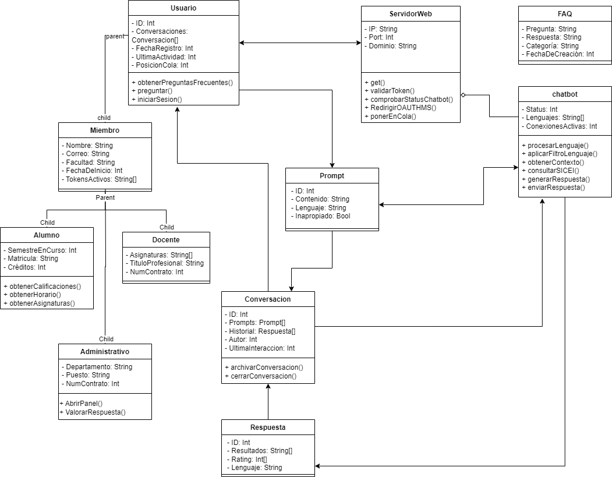

# Diseño de datos

## Índice
* ### [Clases de usuario](#clases-de-usuario-1)
    * [Usuario](#usuario)
    * [Miembro](#miembro)
    * [Alumno](#alumno)
    * [Docente](#docente)
    * [Administrativo](#administrativo)
* ### [ServidorWeb](#servidor-web-1)
* ### [Chatbot](#chatbot-1)
* ### [Prompt](#prompt-1)
* ### [Respuesta](#respuesta-1)
* ### [Conversacion](#conversacion-1)

## <label id="clases-de-usuario-1">👥Clases de usuario</label>
Este conjunto de clases hace referencia a los distintos tipos de usuarios presentes en la estructura del proyecto.

### <label id="usuario">🟦Usuario</label>
---
Esta clase hace referencia a un usuario que no se ha autenticado.

#### 🟢<label id="userid">**ID**</label>
| Tipo de dato |
| --- |
| Int |

*Descripción*

Identificador del usuario.

#### 🟢**Conversaciones**
| Tipo de dato |
| --- |
| [Conversacion[]](#conversacion-1) |

*Descripción*

Lista de las conversaciones que el usuario ha realizado.

#### 🟢**FechaRegistro**
| Tipo de dato |
| --- |
| Int |

*Descripción*

Tiempo del registro de la cuenta en formato [Unix timestamp](https://en.wikipedia.org/wiki/Unix_time).

#### 🟢**UltimaActividad**
| Tipo de dato |
| --- |
| Int |

*Descripción*

Hora de la ultima actividad de la cuenta en formato [Unix timestamp](https://en.wikipedia.org/wiki/Unix_time).

#### 🟡**preguntar()**
Función que 

#### 🟡**iniciarSesion()**
Función que redirecciona al usuario a la pagina de login de Microsoft para proseguir con el proceso de autenticación.

### <label id="miembro">🟦Miembro</label>
---
Clase principal de los usuarios que estan autenticados, de la cual derivan las demás.

#### 🟢**Nombre**
|Tipo de dato|
|---|
| String |

*Descripción*\
Nombre completo de las personas autenticadas.

#### 🟢**Correo**
| Tipo de dato |
| --- |
| String |

*Descripción*

Correo del miembro.

*Ejemplo*
| Valor |
|---|
| A20200000@alumnos.uady.mx |

#### 🟢**Facultad**
| Tipo de dato |
|---|
| String |

*Descripción*\
Facultad de procedencia del usuario autenticado.

*Ejemplos*
| Valor |
|---|
| Facultad de matemáticas |
| Facultad de medicina |
| Facultad de derecho |

#### 🟢**FechaDeInicio**
| Tipo de dato |
|---|
| Int |

*Descripción*

Fecha de inicio de las labores o curso escolar dentro de la institución en formato [Unix timestamp](https://en.wikipedia.org/wiki/Unix_time).

*Ejemplos*
| Valor | Representación |
| --- | --- |
| 1723593600 | martes, 13 de agosto de 2024 18:00:00 GMT-06:00 |

#### 🟢**TokensActivos**
| Tipo de dato |
| --- |
| String[] |

*Descripción*

Una lista de los tokens generados luego de realizar el proceso de [OAuth de Microsoft](https://learn.microsoft.com/es-es/entra/architecture/auth-oauth2), se utiliza para comprobar la identidad del usuario y apartir de ello acceder a información protegida.

*Ejemplo*
| Valor |
|---|
| abcde12345 |

### <label id="alumno">🟦Alumno</label>
---
#### 🟢**SemestreEnCurso**
| Tipo de dato |
| --- |
| Int |

*Descripción*

El número del semestre que actualmente cursa el alumno.

*Ejemplos*
| Valor | Representación |
| --- | --- |
| 6 | 6to semestre |

#### 🟢**Matricula**
| Tipo de dato |
| --- |
| String |

*Descripción*

La matricula del alumno, es otra forma de identificar al usuario, especificamente a los alumnos.

*Ejemplo*
| Valor |
|---|
| A20200000 |

#### 🟢**Créditos**
| Tipo de dato |
| --- |
| Int |

*Descripción*

El total de créditos que el alumno ha alcanzado hasta el momento.

*Ejemplo*

| Valor |
|---|
| 15 |

#### 🟡**obtenerCalificaciones()**
*Descripción*

Función que permite obtener al alumno sus calificaciones de las materias a las que se ha inscrito en el semestre en curso.

#### 🟡**obtenerHorario()**
*Descripción*

Función que permite al alumno obtener las horas, salones, y maestros de las asignaturas a las  que se ha inscrito en el semestre en curso.

#### 🟡**obtenerAsignaturas()**
*Descripción*

Función que regresa las asignaturas que se cursan en el semestre en curso.

### <label id="docente">🟦Docente</label>
---
#### 🟢**Asignaturas**
| Tipo de dato |
| --- |
| String[] |

*Descripción*

Una lista de las asignaturas que el docente imparte.

*Ejemplo*
| Valor |
| --- |
| ["Calculo diferencial", "Calculo Integral"] |

#### 🟢**TituloProfesional**
| Tipo de dato |
| --- |
| String |

*Descripción*

Título de profesión del docente.

#### 🟢**NumContrato**
| Tipo de dato |
| --- |
| Int |

*Descripción*

El número de contrato del docente.

### <label id="administrativo">🟦Administrativo</label>
---
#### 🟢**Departamento**
| Tipo de dato |
|---|
| String |

*Descripción*

Departamento al que pertenece el personal administrativo.

#### 🟢**Puesto**
| Tipo de dato |
| --- |
| String |

*Descripción*

Puesto administrativo del usuario.

#### 🟢**NumContrato**
| Tipo de dato |
| --- |
| Int |

*Descripción*

El número de contrato del personal administrativo.

## <label id="servidor-web-1">🟦ServidorWeb</label>
Clase que interpreta a la entidad del servidor web, la cual maneja las peticiones [HTTP](https://developer.mozilla.org/es/docs/Web/HTTP).

### 🟢IP
| Tipo de dato |
|---|
| String |

*Descripción*

La IP que va a usar el servidor.

### 🟢Port
| Tipo de dato |
| --- |
| Int |

*Descripción*

El puerto en el que el servidor web va a funcionar.

### 🟢Dominio
| Tipo de dato |
| --- |
| String |

*Descripción*

Dominio a utilizar para el servidor.

### 🟡get()
*Descripción*

Función que maneja las peticiones [`GET`](https://developer.mozilla.org/es/docs/Web/HTTP/Methods/GET) del protocolo HTTP.

### 🟡validarToken()
*Descripción*

Función que valida el token del [OAuth de Microsoft](https://learn.microsoft.com/es-es/entra/architecture/auth-oauth2), si determina que es correcto entonces envía una cookie con el token de autenticación para el login del usuario.

### 🟡post()
*Descripción*

Función que maneja las peticiones [`POST`](https://developer.mozilla.org/es/docs/Web/HTTP/Methods/POST) del protocolo HTTP, principalmente para recibir los prompts de los usuarios y redireccionarlas a la clase del [chatBot](#chatBot).

## <label id="chatbot-1">🟦Chatbot</label>
Clase que maneja todo lo relacionado con la lógica del chatbot.

### 🟢Status
| Tipo de dato |
|---|
| Int |

*Descripción*

La disponibilidad del chatbot en el instante.

*Ejemplos*
| Valor | Representación |
| --- | --- |
| 0 | Ok |
| 1 | Sobresaturado |
| 2 | En mantenimiento |

### 🟢Lenguajes
| Tipo de dato |
| --- |
| String[] |

*Descripción*

Array que contiene los lenguajes admitidos por el chatbot.

*Ejemplo*
| Valor |
| --- |
| [ Español, Inglés, Maya ] |

### 🟢conexionesActivas
| Tipo de dato |
| --- |
| Int[] |

*Descripción*

Lista que guarda todas los [ID](#userid) de los usuarios que utilizan el servicio en el momento.

### 🟡<label id="procesarLenguaje">procesarLenguaje()</label>
*Descripción*

Recibe el prompt del usuario y lo analiza, determina en que lenguaje está escrito y qué es lo que requiere.

### <label id="obtenerContexto">🟡obtenerContexto()</label>
*Descripción*

Las conversaciones anteriores que se han tenido con el bot se analizan para obtener el contexto de las partes más importantes y con ello generar una respuesta más precisa.

### 🟡consultarSICEI()
*Descripción*

Función que se encarga de hacer las peticiones a la base datos del [SICEI](https://www.sicei.uady.mx/).

### 🟡generarRespuesta()
*Descripción*

Con los datos analizados en las funciones [procesarLenguaje()](#procesarLenguaje) y [obtenerContexto()](#obtenerContexto) genera una respuesta que se envía de vuelta al [servidor web](#ServidorWeb) y posterior a ello se envia la respuesta al usuario.

### 🟡ponerEnCola()
*Descripción*

Determina si la petición no puede ser procesada en este momento y manda la orden de poner en cola al usuario.

## <label id="prompt-1">🟦Prompt</label>
Clase que guarda la información relacionada al prompt que un usuario escribe para recibir la respuesta del chatbot.
### 🟢 ID
| Tipo de dato |
| --- |
| Int |

*Descripción*

Identificador de la respuesta.

### 🟢Contenido
| Tipo de dato |
| --- |
| String |

*Descripción*

El texto que el usuario ha introducido.

### 🟢Lenguaje
| Tipo de dato |
| --- |
| String |

*Descripción*

El lenguaje del texto que el usuario introdujo.

### 🟢Inapropiado
| Tipo de dato |
| --- |
| Bool |

*Descripción*

Determina si la petición del usuario contiene algún contenido inapropiado para el chatbot.
## <label id="respuesta-1">🟦Respuesta</label>
Clase que almacena el contenido y los metadatos de las respuestas generadas por el chatbot.

### 🟢ID
| Tipo de dato |
| --- |
| Int |

*Descripción*

Identificador de la respuesta.

### 🟢Resultados
| Tipo de dato |
| --- |
| String[] |

*Descripción*

Una lista con todas las respuestas en formato texto generados por el chatbot.

### 🟢Rating
| Tipo de dato |
| --- |
| Int[] |

*Descripción*

Lista con la puntuación que el usuario ha otorgado a una respuesta en especifico.

*Ejemplos*
| Valor | Representación |
| --- | --- |
| -2 | Respuesta no satisfactoria |
| 0 | Puntuación no otorgada |
| 2 | Respuesta satisfactoria |

### 🟢Lenguaje
| Tipo de dato |
| --- |
| String |

*Descripción*

El lenguaje en el cual el texto fue generado.

## <label id="conversacion-1">🟦Conversacion</label>
Clase que almacena los [prompts](#prompt-1) y [respuestas](#respuesta-1) que se han llevado acabo durante una conversación, además de incluir sus metadatos.

### 🟢ID
| Tipo de dato |
| --- |
| Int |

*Descripción*

El identificador de la conversación.

### 🟢Prompts
| Tipo de dato |
| --- |
| [Prompt[]](#prompt-1) |

*Descripción*

Lista con todos los prompts hechos por el [usuario](#usuario) durante la conversación.

### 🟢Historial
| Tipo de dato |
| --- |
| [Respuesta[]](#respuesta-1) |

*Descripción*

Lista con todas las respuestas generadas por el chatbot durante la conversación.

### 🟢Autor
| Tipo de dato |
| --- |
| Int |

*Descripción*

El [id](#userid) del usuario autor de la conversación.

### 🟢UltimaInteraccion
| Tipo de dato |
| --- |
| Int |

*Descripción*

La hora de la última interacción en esa conversación en formato [Unix timestamp](https://en.wikipedia.org/wiki/Unix_time).